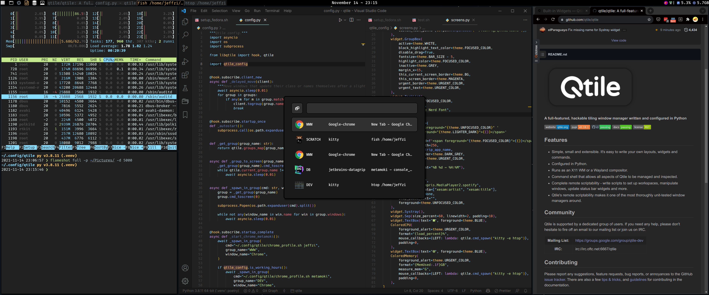
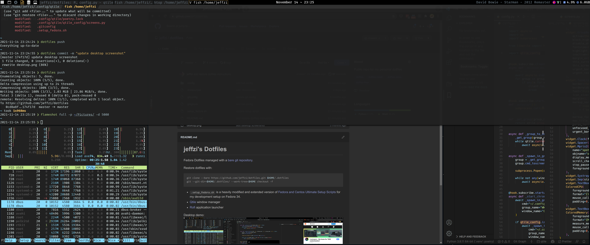

# jeffzi's Dotfiles

Fedora Dotfiles managed with a [bare git repository](https://www.atlassian.com/git/tutorials/dotfiles).

Restore dotfiles with:
```bash
git clone --bare https://github.com/jeffzi/dotfiles.git $HOME/.dotfiles
git --git-dir=$HOME/.dotfiles/ --work-tree=$HOME checkout -f
```

* `.setup_fedora.sh` is a heavily modified and extended version of 
[Fedora and Centos Ultimate Setup Scripts](https://github.com/David-Else/developer-workstation-setup-script)
for my development setup on Fedora 34.
* [Qtile](http://www.qtile.org/) window manager
* [Rofi](https://github.com/davatorium/rofi) application launcher

Desktop demo:

